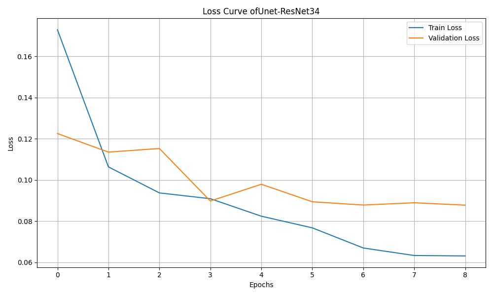
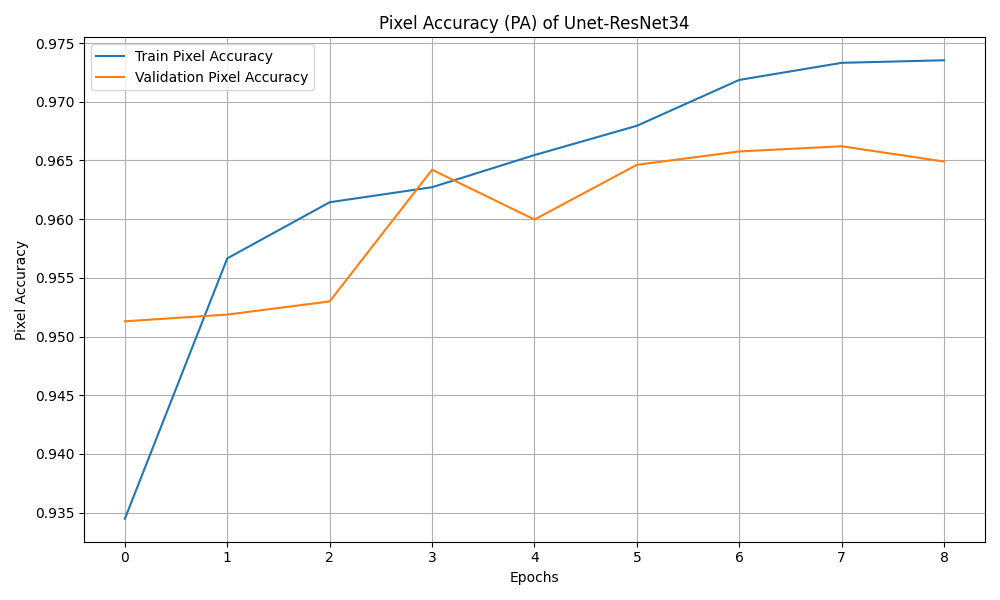
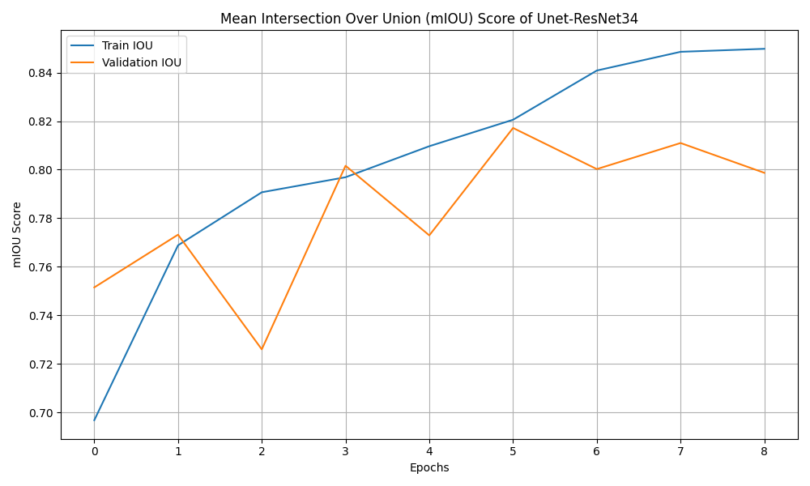
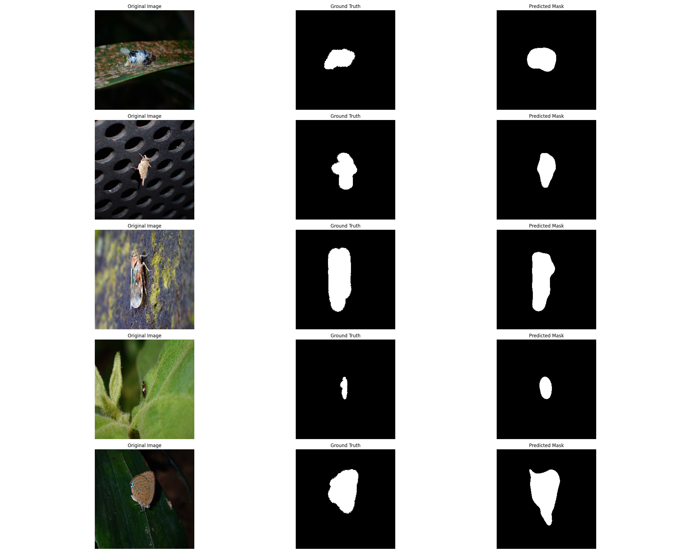

# 🐛 Insect Semantic Segmentation Project

A deep learning project for semantic segmentation of insects using PyTorch and U-Net architecture with ResNet34 encoder. This project includes training, inference, API server, and interactive Streamlit demo capabilities.
NOTE: The Dockerfile should be modified to be able to run this project in GPU!
[Try Demo Here->](https://insect-semantic-segmentation.streamlit.app/)

## 📋 Table of Contents
- [Project Structure](#-project-structure)
- [Results](#-results)
- [Installation](#-installation)
- [Usage](#-usage)
  - [Docker Usage](#-docker-usage)
  - [Local Development](#-local-development)
- [API Usage](#-api-usage)
- [Streamlit Demo](#-streamlit-demo)
- [Training](#-training)
- [Contributing](#-contributing)


## 📁 Project Structure

```
Segmentation_Project/
├── 📄 README.md                     # This file
├── 🐳 Dockerfile                    # Docker configuration
├── ⚙️  docker-entrypoint.sh         # Flexible entrypoint script
├── 🧠 main.py                       # Main training script
├── 🏗️  train.py                     # Training logic
├── 📊 test.py                       # Inference logic
├── 📁 dataset.py                    # Dataset handling
├── 🛠️  utils.py                     # Utility functions and metrics
├── 🌐 api.py                        # FastAPI server
├── 🎨 streamlit_demo.py             # Streamlit demo app
├── 📋 requirements.txt              # Streamlit Cloud dependencies (CPU torch)
├── 📦 packages.txt                  # apt packages for Streamlit Cloud
├── ⚙️  .streamlit/config.toml       # Streamlit app config
├── 🖼️  assets/                      # Bundled sample image for the demo
├── 💾 saved_models/                 # Trained models directory
├── 📉 plots/                        # Training curves (loss, PA, mIoU)
├── 📈 inference_results/            # Inference outputs
└── 📂 datasets/                     # Dataset directory
    └── insect_semantic_segmentation/
        └── arthropodia/
            ├── images/              # Input images
            └── labels/              # Ground truth masks
```
**NOTE:** Download the dataset using **downloader.py** file

## 📉 Results

### 📉 Training Curves

| Loss | Pixel Accuracy | mIoU |
|:---:|:---:|:---:|
|  |  |  |

### 🎯 Inference on Test Images

Five held-out test samples — input, ground-truth mask, and predicted mask:



## 🛠 Installation

### Prerequisites
- Python 3.9+
- Docker (optional)
- 4GB+ RAM
- CUDA GPU (optional, for faster training)

### Docker Installation (Recommended)

```bash
# Clone the repository
git clone <repository-url>
cd <repository-folder>

# Build Docker image
docker build -t segmentation_project .
```

### Local Installation

```bash
# Clone the repository
git clone <repository-url>
cd <repository-folder>

# Install dependencies
pip install torch==2.0.1 torchvision==0.15.2
pip install segmentation-models-pytorch==0.3.3
pip install albumentations==1.3.1 opencv-python==4.8.1.78
pip install matplotlib==3.7.2 numpy==1.24.3 Pillow==10.0.0
pip install tqdm==4.66.1 fastapi==0.104.1 uvicorn==0.24.0
```

## 🚀 Usage

### 🐳 Docker Usage

#### Training Mode
```bash
# Basic training
docker run --rm -v $(pwd):/app segmentation_project

# Custom parameters
docker run --rm -v $(pwd):/app \
  -e EPOCHS=20 \
  -e BATCH_SIZE=16 \
  -e LEARNING_RATE=0.001 \
  segmentation_project train
```

#### API Mode
```bash
# Start API server
docker run --rm -p 8000:8000 -v $(pwd):/app segmentation_project api

# Run inference only
docker run --rm -v $(pwd):/app segmentation_project inference
```

#### Help
```bash
# Show all available options
docker run --rm segmentation_project help
```

### 💻 Local Development

#### Training
```bash
python main.py -bs 16 -lr 0.001 -ep 10 -d cpu -nw 2
```

#### API Server
```bash
uvicorn api:app --host 0.0.0.0 --port 8000
```

#### Streamlit Demo
```bash
pip install -r requirements.txt
streamlit run streamlit_demo.py
```

### API Endpoints

- **GET** `/` - API information
- **GET** `/health` - Health check
- **GET** `/docs` - Interactive API documentation
- **GET** `/model/info` - Model information
- **POST** `/predict` - Single image segmentation
- **POST** `/predict/batch` - Batch image segmentation


Without `MODEL_URL`, the app still runs — users just have to upload a `.pt` file
via the sidebar.

#### Self-hosted

```bash
streamlit run streamlit_demo.py \
  --server.port 8501 \
  --server.address 0.0.0.0 \
  --server.headless true
```